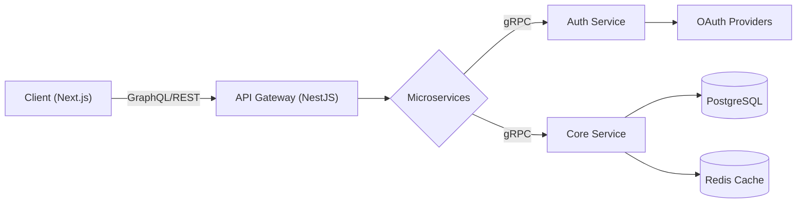

  

  

  

---

### 👨‍💻 About Me

I am a **Senior Full-Stack Engineer** with **6+ years** of experience. I don't just write code; I design systems that scale. My focus is on **performance optimization** (slashing LCP/FCP) and **developer experience** (building tools like `featSlice` and `ts-analyzer`).

- 🔭 **Currently working on:** Distributed gamification systems at **Bitazza**
- 🌱 **Learning:** Rust & Advanced System Design (H3 Indexing)
- 💬 **Ask me about:** React Architecture, NestJS Microservices, and CI/CD Pipelines.
- ⚡ **Fun fact:** I once reduced a bundle size by 10% just by deleting unused localized strings!

---

### 🛠️ The Arsenal

| **Frontend Core** | **Backend & Data** | **DevOps & Cloud** |
|:---:|:---:|:---:|
|        |        |        |

---
### 🏗️ Architecture Philosophy
*I believe in modularity. Here is how I typically structure my Next.js + NestJS projects:*

  
---

### 🌟 Featured Engineering

| **Project** | **Impact & Tech** |
|:---:|:---|
| **[featSlice](https://www.npmjs.com/package/featslice)**   *NPM Package* | 🏗️ **Architectural Tooling**   Automated the scaffolding of Feature-Sliced Design components.   `TypeScript` `Node.js` `CLI` |
| **[ts-analyzer](https://www.npmjs.com/package/ts-analyzer)**   *Static Analysis* | 🛡️ **Code Quality**   AST-based analyzer to detect architectural violations in TS projects.   `TypeScript Compiler API` `AST` |
| **BlockBet Core**   *High-Perf Platform* | ⚡ **Performance Optimization**   Reduced LCP from 11s -> 4s using advanced Next.js caching.   `Next.js` `Redis` `Feature Flags` |

---

📊 The Numbers

<!-- Switched to Mirror URL to fix 503 Error -->

<!-- Snake Animation (More stable than Activity Graph) -->

---

### 🤝 Let's Connect

  
  
  

   
  

